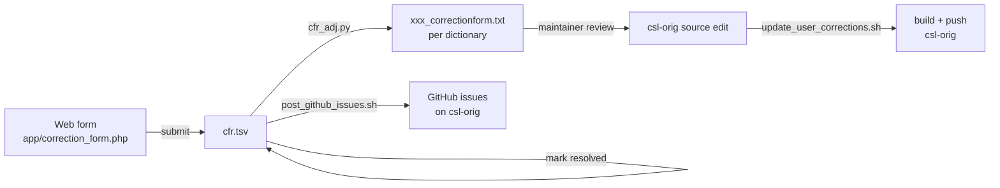
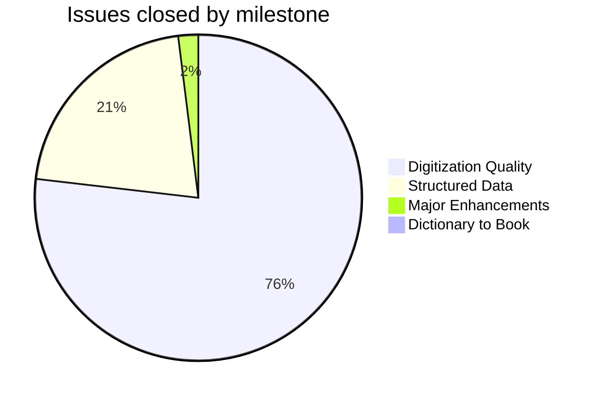
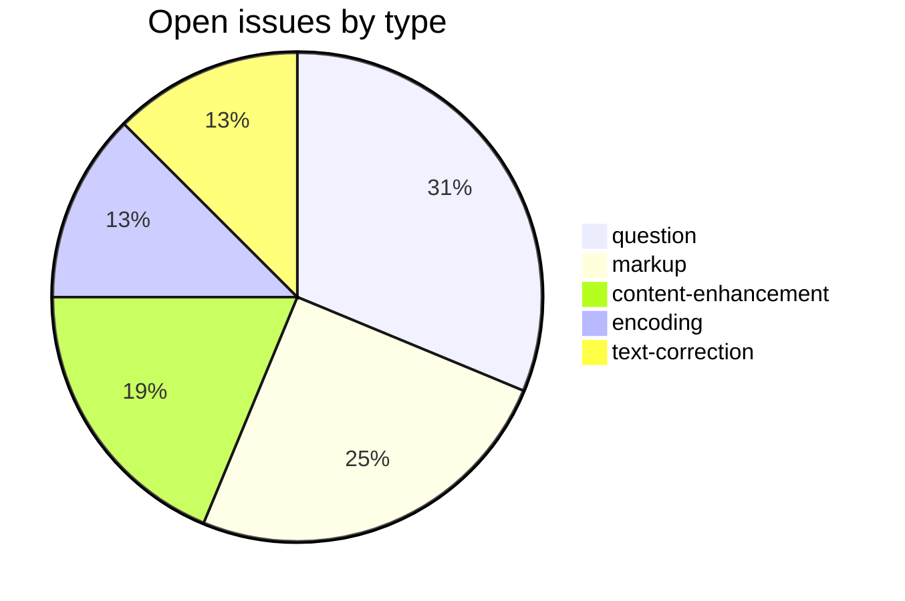
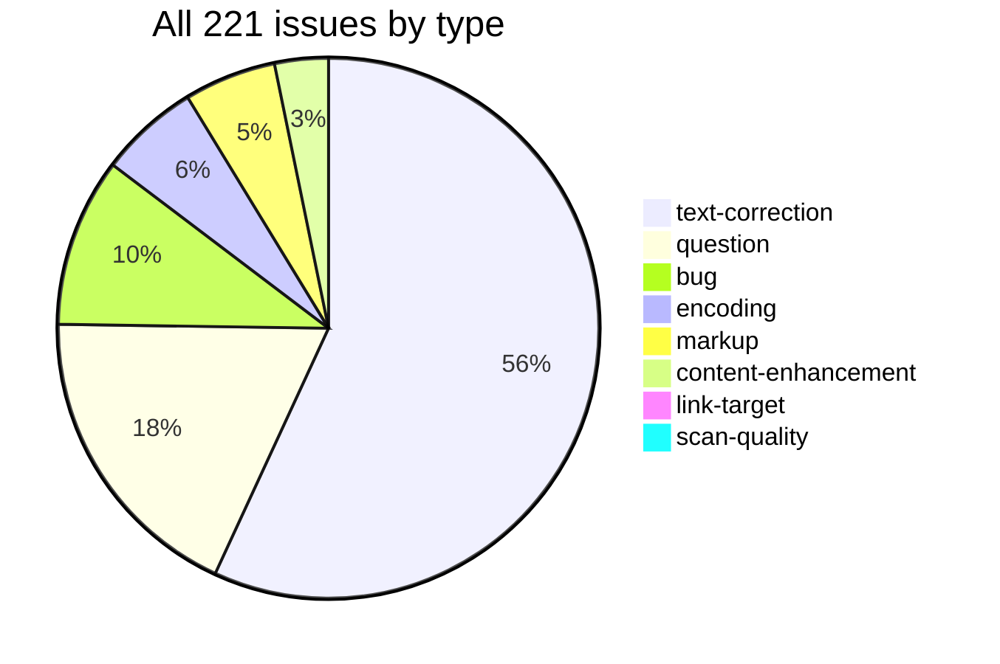

# csl-corrections

Corrections management system for the [Cologne Sanskrit Lexicon](https://www.sanskrit-lexicon.uni-koeln.de/) (CSL). This repository tracks user-submitted corrections to the digitized Sanskrit dictionaries in [csl-orig](https://github.com/sanskrit-lexicon/csl-orig) and maintains a history of intentional deviations from the printed editions.

---

## How it works

1. Users submit corrections via the web form at the Cologne server (`app/correction_form.php`)
2. Submissions accumulate in `app/correction_response/cfr.tsv` (one line per submission)
3. `cfr_adj.py` splits the TSV into per-dictionary files under `dictionaries/<dict>/`
4. Maintainers review pending items, edit the source files in `csl-orig`, and mark each line resolved
5. GitHub issues are opened on `csl-orig` for traceability via `post_github_issues.sh`

Each dictionary `xxx` gets two files:
- `xxx_correctionform.txt` — generated from user submissions (do not edit manually)
- `xxx_printchange.txt` — manually maintained log of intentional deviations from the printed text

---

## Encoding

- UTF-8 NFC throughout.
- Sanskrit text in SLP1 transliteration, wrapped in `{#…#}`.
- Display layer uses IAST (ISO 15919) and Devanagari, generated via `transcoder/` in `csl-pywork`.
- Round-trip verified for the vast majority of entries; exceptions tracked under issue label `encoding`.

---

## Dictionary codes

`acc ae ap ap90 ben bhs bop bor bur cae ccs fri gra gst ieg inm krm lan lrv mci md mw mw72 mwe pd pe pgn pui pw pwg pwkvn sch shs skd stc vcp vei wil yat`

---

## Key scripts

| Script | Purpose |
|---|---|
| `sh redo_cfr.sh` | Regenerate all `xxx_correctionform.txt` files from `cfr.tsv` |
| `sh post_github_issues.sh` | Upload pending corrections as issues to `csl-orig` on GitHub |
| `sh update_user_corrections.sh <dict>` | Rebuild local dictionary, validate XML, commit and push to `csl-orig` |
| `python cfr_adj.py app/correction_response/cfr.tsv correctionform.txt` | Low-level TSV parser (called by `redo_cfr.sh`) |
| `python issues/issue87/issue87.py <dict> [change_file]` | Tag correction markers in dictionary source text |

---

## Timeline

### 2014 — Foundation
- **Feb–Jul**: Begin correcting missing text and headwords for VCP, SKD, AE, AP, AP90, AE, BEN, BOR, MW72, MWE
- **Oct**: Multiple dictionaries converted to SLP1 transliteration; PWG converted; MW/VCP cross-dictionary headword checks
- **Oct–Nov**: Hiatus corrections; Arabic text added to MW; correction form system activated
- **Dec**: Headword corrections for SHS, AP90, PWG, PW, SCH, WIL

### 2015 — Systematic coverage
- **Jan–Feb**: Large headword correction batches for WIL, YAT, MD, BEN, AP; PWG/PW missing data filled (Dr. Sampada Savardekar)
- **Mar–Apr**: SLP1 conversion of MWE, AE, PD, BOP, KRM, PGN; Arabic text in PWG/PW; candrabindu back-corrections across SKD/AP/AP90/PW/VCP
- **Apr–May**: Faultfinder-based corrections for PUI (~520), PD (~80), ACC (~76), IEG (~35), PE (~22), VEI, INM, MCI
- **Jun–Jul**: Greek text in PW/PWG (500+ cases); HxA corrections to MW (~170)
- **Nov–Dec**: `mw_printchange.txt` established; `printchange` files initialized for STC, MD, BEN, WIL, INM, SKD, SHS, CCS, CAE, BUR, SCH, PW, AP90; PW literary source corrections (6000+ changes)

### 2016 — Large-scale textual corrections
- **Jan–Apr**: AP/AP90 corrections (~1000+); CCS corrections (~1600); PD corrections (~1280); CAE corrections (~850); BEN corrections (~425); SKD corrections (~200)
- **Jun**: BUR corrections (~650); MW72 Unicode conversion (~2500 changes)
- **Jul–Nov**: WIL corrections (~200+); alternate headwords for AP90/SKD/VCP; AE corrections begin (batches 1–11, Dr. Sampada Savardekar)
- **Dec**: MW72 headword corrections (continued batches); WIL corrections (continued)

### 2017 — IAST/meta-line conversion wave
- **Jan–Mar**: AE corrections (pages 1–39); AP/AP90 large batches (~750 changes); MD/BUR/BEN/ACC converted to IAST Unicode
- **Apr–Jun**: AP/MD meta-line conversion; SCH IAST corrections; AE corrections (pages 40–129)
- **Jul–Aug**: BUR IAST/meta-line; SHS AS→IAST (~7000); VCP meta-line + alternate headwords (~1700)
- **Sep–Oct**: STC IAST/meta-line; AE corrections (pages 130–319); PW IAST/meta-line; MW72 Greek text
- **Nov–Dec**: CCS/IEG/BHS/KRM/GRA/PW IAST/meta-line conversions; AE corrections (pages 320–359)

### 2018 — Remaining dictionary modernisation
- **Jan–Feb**: AE corrections (pages 360–501) — **Dr. Sampada Savardekar finishes AE**; BOP/BHS/KRM/GRA/IEG/GST/PD/MCI/PE/PGN/PUI/VEI/BOR/MWE/MW72 IAST/meta-line conversions
- **Mar**: MW72 full IAST conversion complete
- **Jun–Nov**: Ongoing correction form batches (~15–30 per round)

### 2019 — Targeted corrections
- **Jul**: STC c-cedilla → Ś/ś corrections (~655 changes)
- **Jul–Oct**: Correction form batch (~90 corrections across dictionaries)

### 2020 — Markup improvements
- **Jan**: MW homonym markup (~800 changes); MW Varttika abbreviations (~1200 changes)
- **Jan**: STC abbreviations added
- **Feb**: PW preverb markup (~600 changes)

### 2021–present — Ongoing user corrections
- Daily correction form submissions processed in batches
- Per-issue targeted fixes tracked under `issues/` and `daily/YYYYMMDD/`

---

## Projects & Milestones

Issues are organised into four milestones matching the org-wide GitHub Projects:

| Milestone | Project | Open | Closed | Total |
|---|---|---:|---:|---:|
| Dictionary to Book | DTB | 0 | 2 | **2** |
| Digitization Quality | DQ | 4 | 156 | **160** |
| Structured Data | SD | 9 | 43 | **52** |
| Major Enhancements | ME | 3 | 4 | **7** |
| **Total** | | **16** | **205** | **221** |

---

## Issue Typology

### Open (15)

| # | Type | Title | Severity |
|---|---|---|---|
| [#10](https://github.com/sanskrit-lexicon/csl-corrections/issues/10) | markup | WIL separating genders | minor |
| [#26](https://github.com/sanskrit-lexicon/csl-corrections/issues/26) | content-enhancement | autofill correction form | minor |
| [#38](https://github.com/sanskrit-lexicon/csl-corrections/issues/38) | encoding | IEG ळ / ड़ errors | minor |
| [#45](https://github.com/sanskrit-lexicon/csl-corrections/issues/45) | encoding | PUI inconsistent diacritics | medium |
| [#69](https://github.com/sanskrit-lexicon/csl-corrections/issues/69) | question | IEG diestruck (non-Sanskrit headwords) | minor |
| [#78](https://github.com/sanskrit-lexicon/csl-corrections/issues/78) | markup | it markers to be marked up in SKD | minor |
| [#87](https://github.com/sanskrit-lexicon/csl-corrections/issues/87) | question | How can we use the printchange files? | minor |
| [#119](https://github.com/sanskrit-lexicon/csl-corrections/issues/119) | question | Sanskrit Questions for Andhrabharati (Part-7) | minor |
| [#120](https://github.com/sanskrit-lexicon/csl-corrections/issues/120) | markup | Missing vacana marks | minor |
| [#173](https://github.com/sanskrit-lexicon/csl-corrections/issues/173) | question | How to display the resolved compounds in AP? | minor |
| [#175](https://github.com/sanskrit-lexicon/csl-corrections/issues/175) | markup | AP: inline ({@{#-XXXX#}@}) | minor |
| [#195](https://github.com/sanskrit-lexicon/csl-corrections/issues/195) | content-enhancement | AP: Add artificial homonyms while displaying results | medium |
| [#207](https://github.com/sanskrit-lexicon/csl-corrections/issues/207) | question | AP: vimAtrā | minor |
| [#212](https://github.com/sanskrit-lexicon/csl-corrections/issues/212) | text-correction | printchange incorporation tracker | medium |
| [#219](https://github.com/sanskrit-lexicon/csl-corrections/issues/219) | content-enhancement | AP: Homonym number requests | medium |
| [#221](https://github.com/sanskrit-lexicon/csl-corrections/issues/221) | text-correction | Daily Corrections - 2026-05-14 | medium |

### Solved (205)

| Type | Count |
|---|---:|
| text-correction | 122 |
| question | 35 |
| bug | 22 |
| encoding | 11 |
| markup | 8 |
| content-enhancement | 4 |
| link-target | 2 |
| scan-quality | 1 |
| **Total** | **205** |

---

## Labels

### Type labels (color `#0075ca`)

| Label | Total | Description |
|---|---:|---|
| `text-correction` | 124 | Corrections to dictionary text (definitions, headwords) |
| `question` | 40 | Scholarly questions requiring research before any code change |
| `bug` | 22 | Broken links, XML structure errors, broken download files |
| `encoding` | 13 | SLP1/IAST transcoding, character rendering, hyphen/dash normalisation |
| `markup` | 12 | Normalising XML tag content (`<ls>`, `<lex>`, `<ab>`, etc.) |
| `content-enhancement` | 7 | New material, display upgrades, structural additions beyond correction |
| `link-target` | 2 | Building click-throughs from `<ls>` abbreviations to scanned PDF pages |
| `scan-quality` | 1 | Replacing blurry, skewed, or missing scan pages |
| `link-splitting` | 0 | Splitting combined `SOURCE N,N` refs into individual per-page links |

### Severity labels

| Label | Color | Total | Description |
|---|---|---:|---|
| `minor` | `#e4e669` | 116 | Targeted, self-contained fix |
| `medium` | `#fbca04` | 105 | Standard unit of work — one index, a batch of corrections |
| `hard` | `#d93f0b` | 0 | Large effort spanning many sources, files, or dictionaries |

---

## People

### Maintainers / implementors

| Person | Role |
|---|---|
| **Jim Funderburk** | Founder and primary maintainer; designed the correction pipeline and performed the bulk of systematic corrections 2014–2020 |
| **Dr. Sampada Savardekar** | Led the comprehensive AE (Apte English) correction campaign 2015–2018 (pages 1–501); PWG missing-data corrections |
| **Dr. Dhaval Patel** | Current active maintainer; developed `upload_github_issue.py`, `issue87.py`, and daily correction automation |

### Top correction submitters (by volume, from correction form)

| Submissions | Email |
|---|---|
| 322 | srhodes@snowcrest.net |
| 231 | frank.ziesing@web.de |
| 116 | geymonat@sanscrito.it |
| 114 | zaaf2@hotmail.com |
| 82 | h.c.jahr@gmx.de |
| 68 | sanaatani@gmail.com |
| 55 | v.g.000002@gmail.com (Vladimir Grekov) |
| 51 | chandrasekharanr@gmail.com |
| 39 | christian.ferstl@univie.ac.at |
| 39 | pvstiles@yahoo.co.uk |

---

## Related repositories

- [`csl-orig`](https://github.com/sanskrit-lexicon/csl-orig) — dictionary source files that corrections are applied to
- [`csl-pywork`](https://github.com/sanskrit-lexicon/csl-pywork) — build toolchain (`generate_dict.sh`, `xmlchk_xampp.sh`)
