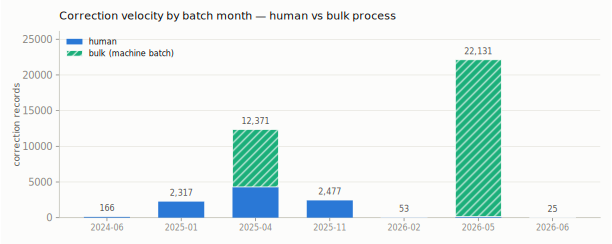
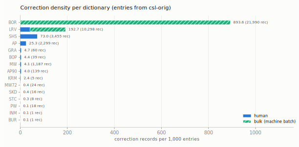
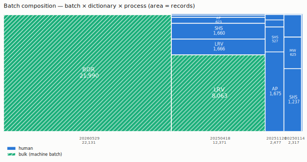
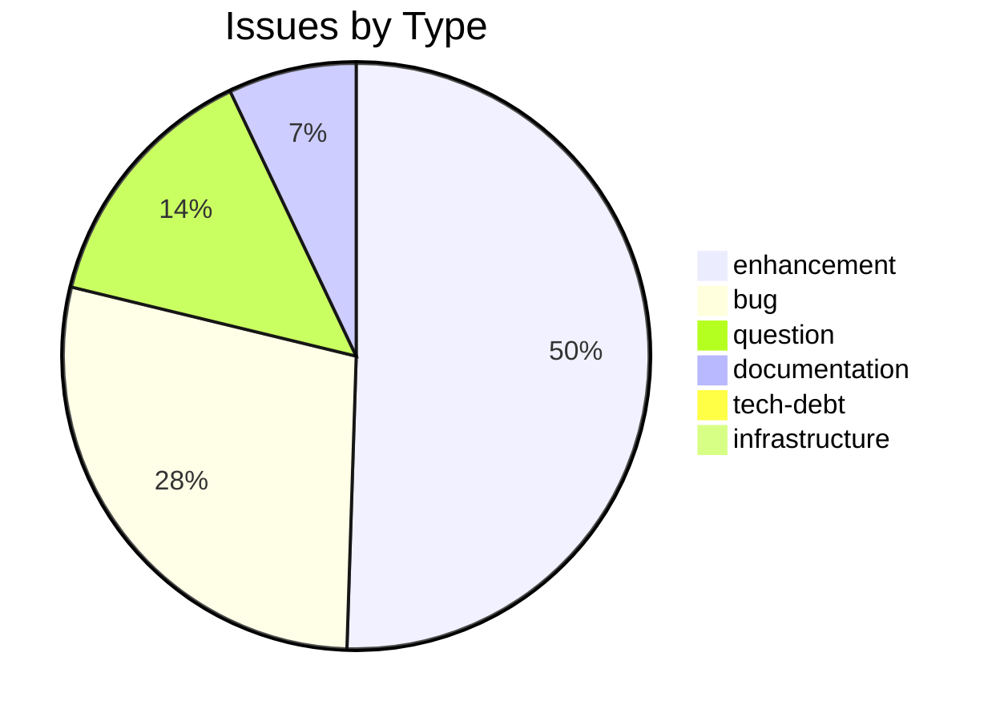
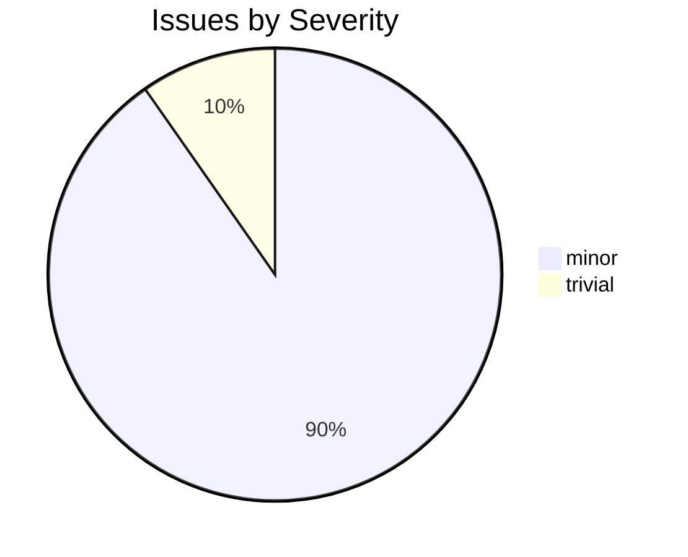

# csl-corrections

_Created: 16-12-2019 · Last updated: 07-07-2026_

CDSL **data-store** repository in the Sanskrit Lexicon project.

## Documentation

📘 **[Correction Workflow — End-to-End](docs/correction-workflow.md)** — the authoritative guide for applying corrections to `csl-orig` dictionary text. Covers the full pipeline (snapshot → apply → validate → audit → commit), tooling reference, repository topology, and pitfalls.

📗 **[Batch Processing Runbook](docs/BATCH_RUNBOOK.md)** — the operator manual for everything *around* that workflow: intake (form → daily cron → `cfr_ab` registry), the mandatory preflight, batch-folder assembly and lifecycle, derived-data rebuilds, and issue-taxonomy upkeep — with a symptom→cause→cure table and glossary.

## Example change file

A real paired old→new record from
[`batches/20251126/dictionaries/mw/change_mw_1.txt`](batches/20251126/dictionaries/mw/change_mw_1.txt)
— MW line 8104, root `aYj` (SLP1), fixing a sandhi typo in the perfect stem
(`A-naYja` → `AnaYja`):

```
; <L>2267<pc>11,1<k1>aYj<k2>aYj<e>1
8104 old <s>aYj</s> ¦ <ab>cl.</ab> 7. <ab>P.</ab> <ab>Ā.</ab> <s>ana/kti</s>, <s>aNkte/</s>, <s>A-naYja</s>, <s>aYjizyati</s> or <s>aNkzyati</s>, <s>AYjIt</s>, <s>aYjitum</s> or <s>aNktum</s>, to apply an ointment or pigment, smear with, anoint;
;
8104 new <s>aYj</s> ¦ <ab>cl.</ab> 7. <ab>P.</ab> <ab>Ā.</ab> <s>ana/kti</s>, <s>aNkte/</s>, <s>AnaYja</s>, <s>aYjizyati</s> or <s>aNkzyati</s>, <s>AYjIt</s>, <s>aYjitum</s> or <s>aNktum</s>, to apply an ointment or pigment, smear with, anoint;
;---------------------------------------------------
```

Applied per the org-wide pattern documented in [`docs/correction-workflow.md`](docs/correction-workflow.md):

```sh
python updateByLine.py mw.txt change_mw_1.txt mw_corrected.txt
```

The `;`-prefixed lines are comments/separators; the `<L>` header line records
the source record's original locus (`<pc>` page/column, `<k1>`/`<k2>` head
keys) so the change survives re-derivation from `csl-orig`.

## Derived data — correction loci

[`data/derived/correction_loci.tsv`](https://github.com/sanskrit-lexicon/csl-corrections/blob/main/data/derived/correction_loci.tsv)
holds **one row per correction record** (39,540 as of 07-07-2026) parsed from every
change file in the batch folders — both dialects (standard paired `old`/`new` records
and the GRA inline `<chg>` wrapper). Columns: `dict, L, pc_page, pc_col, k1, k2, line,
batch, batch_date, process, directive, tag_context, old, new`, with
`process ∈ {bulk, human}` separating the two machine-generated markup batches
(BOR 21,990 + LRV/markhom 8,063 = 76% of records) from steady human correction.
Corrector identity is deliberately excluded. Spec and hypotheses:
[`docs/HYPOTHESES_AND_VIZ_MEMO.md`](https://github.com/sanskrit-lexicon/csl-corrections/blob/main/docs/HYPOTHESES_AND_VIZ_MEMO.md) §5.1.

Rebuild (validates the census invariants) and regenerate the figures:

```sh
python scripts/build_correction_loci.py --selftest
python scripts/build_correction_viz.py
```







Entry counts for the density chart come from
[`data/derived/dict_entry_counts.tsv`](https://github.com/sanskrit-lexicon/csl-corrections/blob/main/data/derived/dict_entry_counts.tsv)
(`grep -c '^<L>'` over csl-orig v02, cached here so the viz never needs csl-orig).

## Issues Overview

**Total**: 100 | **Open**: 7 | **Closed**: 93

### By Milestone

| Milestone | Open | Closed | Total |
|---|---|---|---|
| Dictionary to Book | 0 | 1 | 1 |
| Digitization Quality | 2 | 77 | 79 |
| Major Enhancements | 2 | 2 | 4 |
| Structured Data | 3 | 13 | 16 |

### By Type



### By Severity



## GitHub Issue Conventions

Follows the [Cologne tooling-repo taxonomy](https://github.com/sanskrit-lexicon/csl-observatory/blob/main/runbook/cologne-tooling-runbook.md):

- **9 type labels**: bug, feature, enhancement, performance, tech-debt, security, documentation, infrastructure, question
- **4 severity levels**: trivial, minor, major, critical
- **5 milestones**: API Stability, User Experience, Data Quality, Developer Experience, Community
- **Org Project**: [Tooling Roadmap](https://github.com/orgs/sanskrit-lexicon/projects/9)

See [CLAUDE.md](CLAUDE.md) for full definitions.

---
*Generated by Cologne Tooling Runbook on 2026-05-15*

_Dr. Mārcis Gasūns_
