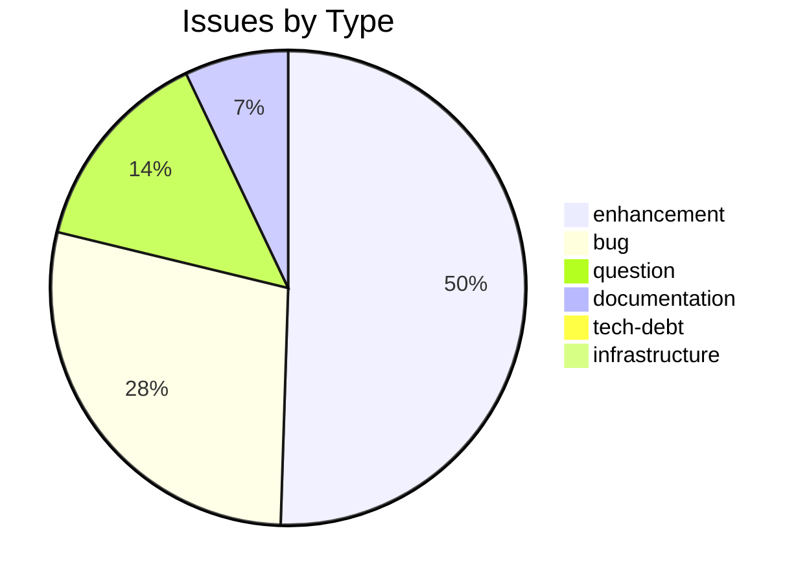
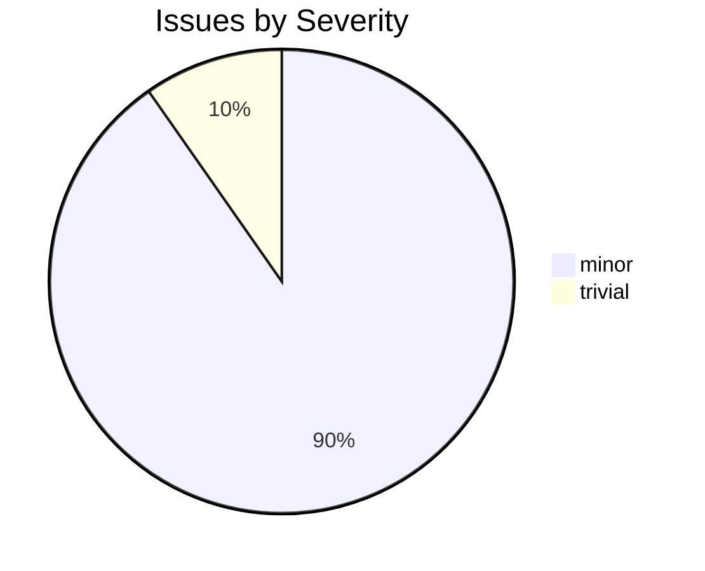

# csl-corrections

CDSL **data-store** repository in the Sanskrit Lexicon project.

## Documentation

📘 **[Correction Workflow — End-to-End](docs/correction-workflow.md)** — the authoritative guide for applying corrections to `csl-orig` dictionary text. Covers the full pipeline (snapshot → apply → validate → audit → commit), tooling reference, repository topology, and pitfalls.

## Issues Overview

**Total**: 100 | **Open**: 7 | **Closed**: 93

### By Milestone

| Milestone | Open | Closed | Total |
|---|---|---|---|
| Dictionary to Book | 0 | 1 | 1 |
| Digitization Quality | 2 | 77 | 79 |
| Major Enhancements | 2 | 2 | 4 |
| Structured Data | 3 | 13 | 16 |

### By Type

### By Severity

## GitHub Issue Conventions

Follows the [Cologne tooling-repo taxonomy](https://github.com/sanskrit-lexicon/csl-observatory/blob/main/runbook/cologne-tooling-runbook.md):

- **9 type labels**: bug, feature, enhancement, performance, tech-debt, security, documentation, infrastructure, question
- **4 severity levels**: trivial, minor, major, critical
- **5 milestones**: API Stability, User Experience, Data Quality, Developer Experience, Community
- **Org Project**: [Tooling Roadmap](https://github.com/orgs/sanskrit-lexicon/projects/9)

See [CLAUDE.md](CLAUDE.md) for full definitions.

---
*Generated by Cologne Tooling Runbook on 2026-05-15*
